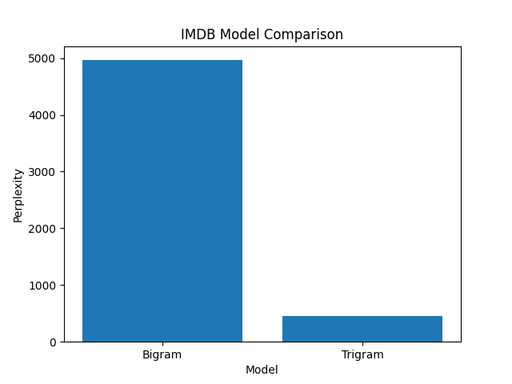
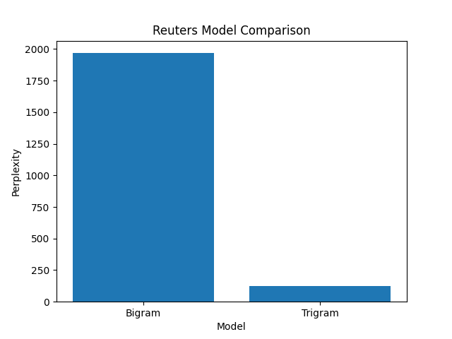

# 🔤 N-Gram Language Modeling with Smoothing Techniques

> 🚀 Achieved up to **15x reduction in perplexity** using Back-off smoothing in trigram models.

A complete implementation of word-level N-gram language models from scratch in Python, demonstrating how smoothing techniques solve real-world NLP challenges like data sparsity.

---

## 📌 Project Overview

This project builds **Unigram, Bigram, and Trigram** language models and evaluates their performance using **perplexity** on real-world datasets.

Higher-order models often fail due to **data sparsity** — this project shows how **Back-off smoothing** dramatically improves performance.

---

## 🚀 Key Highlights

- Built N-gram models from scratch (no external NLP libraries)
- Implemented **Laplace smoothing** and **Back-off smoothing**
- Evaluated models using **perplexity metric**
- Compared performance across:
  - IMDB (informal text)
  - Reuters (formal text)
- Achieved **~10x–15x reduction in perplexity**
- Visualized results using Matplotlib

---

## 📊 Results Summary

| Dataset | Model   | Smoothing | Perplexity |
|-------- |-------- |---------- |----------- |
| IMDB    | Bigram  | Laplace   | 4964       |
| IMDB    | Trigram | Backoff   | 457        |
| Reuters | Bigram  | Laplace   | 1967       |
| Reuters | Trigram | Backoff   | 125        |

---

## 🔥 Performance Improvement

- **IMDB:** 4964 → 457 (**~10x improvement**)  
- **Reuters:** 1967 → 125 (**~15x improvement**)  

👉 Key takeaway:  
> Trigram models are ineffective without proper smoothing — Back-off makes them practical.

---

## 📈 Results Visualization

### IMDB Dataset


### Reuters Dataset


---

## 🧠 Key Insights

- Trigram models initially performed worse due to **data sparsity**
- **Back-off smoothing** significantly improves higher-order models
- **Laplace smoothing** overestimates probabilities and hurts performance
- Structured datasets (Reuters) yield lower perplexity than noisy datasets (IMDB)

---

## ⚙️ How to Run
```
pip install -r requirements.txt
python main.py
```


📁 Output
results/results.csv → numerical results
plots/ → comparison graphs

---

📂 Datasets
Datasets are not included due to size constraints.
Download from:
- IMDB Movie Reviews Dataset (Kaggle)
- Reuters News Dataset (NLTK)

---

🧩 Tech Stack
Python
Pandas
Matplotlib
NLTK (for dataset support)

---

💡 Why This Project Matters
This project demonstrates practical NLP challenges such as:
- Handling data sparsity
- Understanding language model limitations
- Applying smoothing techniques effectively
It bridges the gap between theoretical NLP concepts and real-world implementation.

---

 🚀 Future Improvements
- Implement Kneser-Ney smoothing
- Add next-word prediction system
- Build a Streamlit demo UI
- Compare with neural language models

---

 👤 Author
 
Vaidehi Pansuriya

Computer Engineering Student | AI/ML Enthusiast

---

 ⭐ If you found this useful, consider giving it a star!
